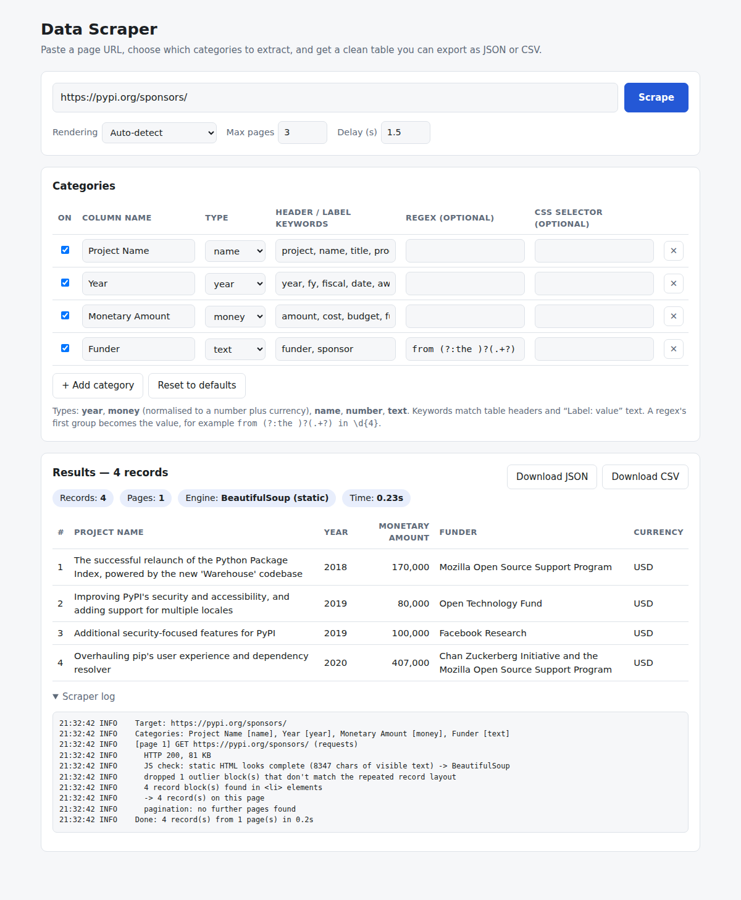

# Data Scraper

Paste a URL, choose the categories of data you want (by default **Project Name**, **Year** and **Monetary Amount**), and get a clean table that you can export as `data.json` or CSV. You can use it from the command line or from a small web UI.



## Quick start

```bash
python3 -m venv .venv
source .venv/bin/activate            # Windows: .venv\Scripts\activate
pip install -r requirements-dev.txt
playwright install chromium          # only needed for JavaScript-rendered sites

# Command line: writes data.json and prints a table
python scraper.py https://pypi.org/sponsors/

# Web UI: http://127.0.0.1:5000
python app.py
```

## Command line

```bash
python scraper.py URL [options]
python scraper.py                                   # prompts for the URL

  -c, --categories FILE     category definitions (see categories.example.json)
  -a, --add-category SPEC   add one: "Funder:text:from (?:the )?(.+?) in \d{4}"
      --only "Year,Project Name"   keep only these columns
      --max-pages N         pagination limit (default 10)
      --delay SECONDS       base delay between requests, jittered (default 1.5)
      --render auto|static|js   auto-detect (default), force BeautifulSoup, force Playwright
      --csv data.csv        also write a CSV
      --ignore-robots       skip robots.txt (only with the site owner's permission)
```

## Categories

Each category becomes one column. You edit them in the web UI's table or in a JSON file:

| field      | meaning |
|------------|---------|
| `name`     | column name in the output |
| `type`     | `year`, `money` (normalised to a number, with a `Currency` column), `name`, `number` or `text` |
| `keywords` | matched against table headers and `Label: value` text |
| `pattern`  | optional regex; its first group becomes the value |
| `selector` | optional CSS selector evaluated inside each record |

## How it works

1. **Fetch and choose the engine.** The page is fetched with `requests`. `needs_javascript()` then checks for bot challenges, near-empty bodies with scripts, and empty SPA mount points (`#root`, `#__next`, …). If the page needs JavaScript, it is re-rendered in headless Chromium through **Playwright**. Otherwise **BeautifulSoup** parses the static HTML.
2. **Find records.**
   - **Tables:** columns are mapped to categories by header keywords, or by content when headers don't match. Rowspan/colspan are handled, and headers like "(US$ millions)" scale the values.
   - **Cards, lists and paragraphs:** the scraper finds the smallest elements that contain the detectable categories (year, money, your regexes). Each one is grown to its record container (`li`, `article`, `.card`, …). Blocks that don't match the page's repeated layout are dropped.
3. **Pagination.** The scraper follows `rel=next`, "Next ›" and "Older" links, `aria-label` markers, `?page=N+1` links, and, in browser mode, clicks JavaScript-only "Next" buttons.
4. **Politeness and robustness.**
   - It respects robots.txt, including `*` and `$` wildcards.
   - It waits a jittered delay between pages.
   - Retries use exponential backoff on 429/5xx and honour `Retry-After`.
   - Each page is wrapped in try/except, so one failure ends the run cleanly with the data already collected.
   - A null audit lists any column with missing values.

Output (`data.json`):

```json
{
  "meta": { "source_url": "...", "render_mode": "beautifulsoup", "pages_scraped": 1,
            "record_count": 4, "categories": [...], "warnings": [] },
  "records": [
    { "Project Name": "Additional security-focused features for PyPI", "Year": 2019,
      "Monetary Amount": 100000.0, "Currency": "USD", "source_url": "https://pypi.org/sponsors/" }
  ]
}
```

## Tests

```bash
pytest -q
```

The suite runs against local fixture sites in `tests/fixtures`: a paginated table, `?page=N` cards, and a JavaScript SPA with a click-only "Next" button. To try them by hand, run `python tests/fixture_server.py 8765` and scrape `http://127.0.0.1:8765/table-1.html`.

## Deploying it publicly

| Host | What runs | JavaScript sites? | Notes |
|------|-----------|-------------------|-------|
| **Vercel** | Flask as a Python serverless function (`api/index.py`, `vercel.json`) | No (no browser in the function) | Free tier, custom domain, HTTPS. Falls back to static HTML. |
| **Render / Railway / Fly.io / Cloud Run** | `Dockerfile` (Playwright base image and gunicorn) | Yes | Always-on container; a small paid plan is usually needed for browser memory. |
| **tiiny.host, GitHub Pages, Netlify static** | Static files only | n/a | Can host a front end, but **not** the scraper. Python can't run there, and browsers block cross-site fetches (CORS). Point the front end at an API hosted on Vercel or Render. |

**Vercel:** push the repo to GitHub, click "Add New Project" in Vercel and import it (no build settings needed), then add your domain under *Settings → Domains*. You can also run `npm i -g vercel && vercel --prod`.

**Render (full version):** create a New Web Service from the repo and choose the Docker runtime. It builds the `Dockerfile` and gives you an `onrender.com` URL, to which you can attach a custom domain.

### Checklist before making it public

- **SSRF protection** is on by default in `app.py`. Private, loopback and link-local targets are refused, including through redirects and browser sub-requests. Set `ALLOW_PRIVATE_URLS=1` only for local testing.
- **Limits:** `MAX_PAGES_LIMIT` (default 10) and `MIN_DELAY` (default 1s) are environment variables. Add rate limiting per visitor (for example Flask-Limiter, or Vercel's firewall) so the service can't be used to hammer other sites.
- **Timeouts:** serverless functions stop after `maxDuration` seconds. For long crawls, move scraping into a background job (a queue plus a worker) and poll for results.
- **Legal and ethical:** keep robots.txt checks on, identify your bot in the User-Agent, and respect site terms and copyright on the data you republish.
